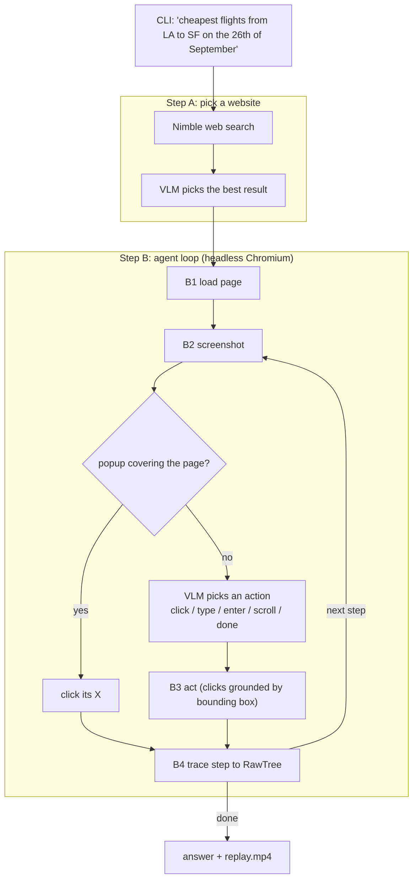

# long-horizon-agents-hackathon

Ask a flight question in plain English. An on-device vision model (Liquid AI LFM2.5-VL-3B, run locally with MLX) finds a good site and browses it the way a person would, from screenshots only.



**A. Pick a website.** The question goes to Nimble's search API. The local VLM reads the result titles and picks the one where flights can be searched.

**B. Agent loop.** It runs until the model says `done` or `--max-steps` is reached.
- **B1** loads the chosen page in headless Chromium (Playwright).
- **B2** takes a screenshot. First the VLM answers one question: is a popup covering the page? If so, it clicks the popup's close button. Otherwise it picks the next action from the screenshot, the task and its past actions.
- **B3** does the action. For a click, the VLM returns the target's bounding box and the agent clicks its centre. An action that leaves the screen unchanged is marked as such in the history.
- **B4** sends the step (thought, action, result, URL, latency) to RawTree.

The VLM makes one decision per call because the 3B model is reliable on single questions and unreliable when asked to chain several.

## Run

```sh
cd browser-use-loop
uv sync && uv run playwright install chromium
NIMBLE_API_KEY=... RAWTREE_API_KEY=... uv run main.py "Give me the cheapest flights from LA to SF on the 26th of September"
uv run main.py "..." --url https://www.kayak.com/flights   # skip step A
uv run main.py "..." --learn                               # learn from past runs (below)
uv run python -m unittest discover -s tests                # tests, no model or network
```

| Env var | |
|---|---|
| `NIMBLE_API_KEY` (or `NIMBLE_KEY`) | step A search |
| `RAWTREE_API_KEY` | traces; skipped if unset |
| `NIMBLE_PROXY` | optional, routes the browser through Nimble's proxy |

**Outputs:**
- `runs/<run_id>/`: one screenshot per step and `replay.mp4` (1.5 s per step, red circle on each click, the model's thought and action underneath).
- RawTree tables: `v4_site_picks`, `v4_runs`, `v4_steps` and `v4_results` (and `v4_reflections` with `--learn`).

**Learning (`--learn`, off by default).** Ported from the archived agent's reflection loop (`learning.py`).
- Before the run, the 8 most recent active lessons from `runs/lessons.json` are appended to the action prompt.
- After the run, the VLM gets the task, the outcome, every action with its result (no-ops marked) and a grid of step screenshots. It returns `{"remove": [lesson ids], "lessons": ["If ..., then ..."]}`.
- Lessons it blames are deactivated, not deleted. New lessons are kept only if they are general: no digits, no capitalized names (cities, airport codes, sites), no words from the task's names, no dates, no URLs and no secrets. Lowercase names that are not in the task can still get through.
- A lesson's id is `sha256(normalized text)[:16]`, so it stays the same across runs.
- If the reflection fails, it is logged and the run is unaffected. Without `--learn`, the prompts and traces are unchanged.

With `--learn`, RawTree also gets `learning` and `active_lesson_ids` on `v4_runs`, plus `no_op_steps` on `v4_results`. Each `v4_steps` row gets `active_lesson_ids`, `no_op` and `model_ms` (model time per call kind: `policy`, `grounding`, `popup_check`). One `v4_reflections` row per run records success, steps, no-op steps, the ids and texts of lessons added and removed, the latency and any error.

`archived/browser-use-loop` holds the earlier MiniWoB agent, which has a reflection and lessons loop and Tinybird telemetry.
